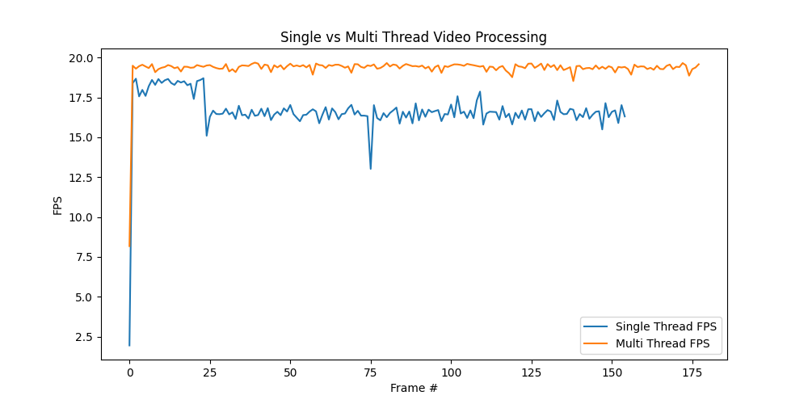

# Real-Time Video Processing on Embedded Systems

This project demonstrates **real-time video processing** using **single-threading** and **multi-threading** with Python/OpenCV.  
It is designed to run on a **Raspberry Pi**, but works on any system with Python and OpenCV installed.

---

## Features

- Single-threaded video capture and processing
- Multi-threaded video processing for higher FPS
- Face detection, grayscale conversion, and blur effects
- Real-time FPS monitoring
- Visual FPS graph (optional)

---

## Project Structure

